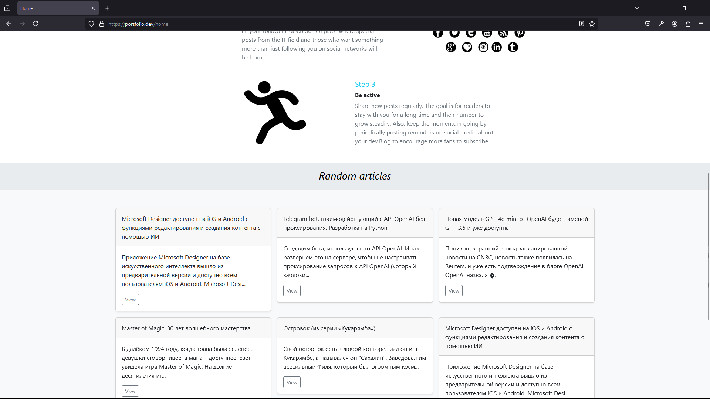
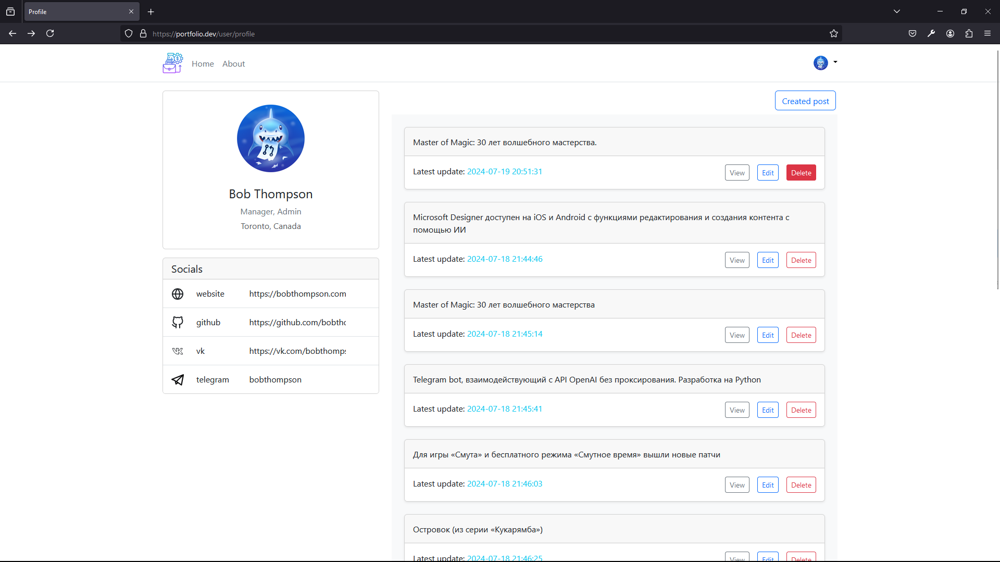
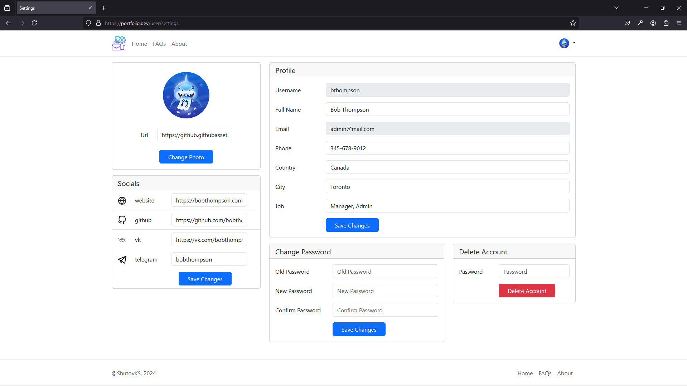
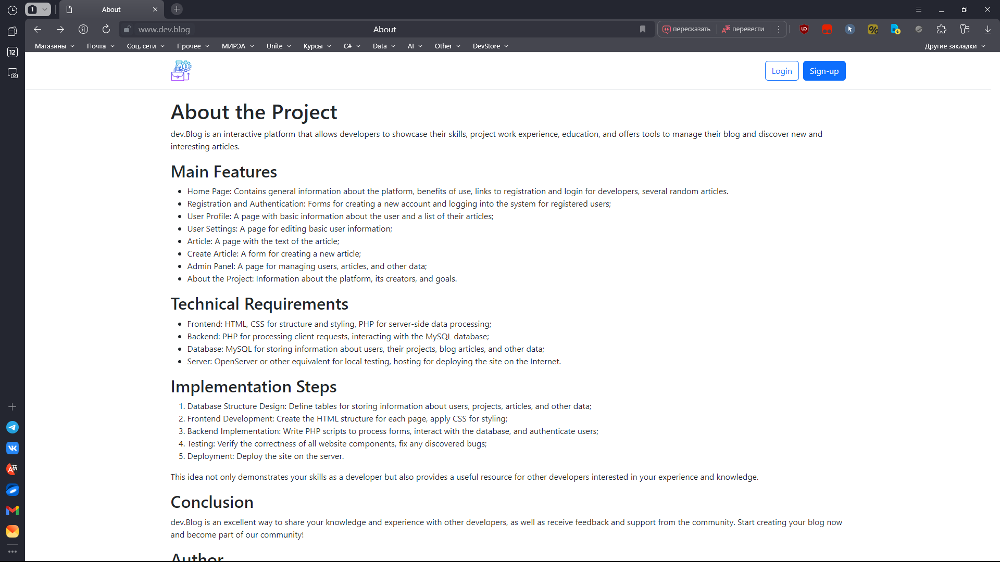
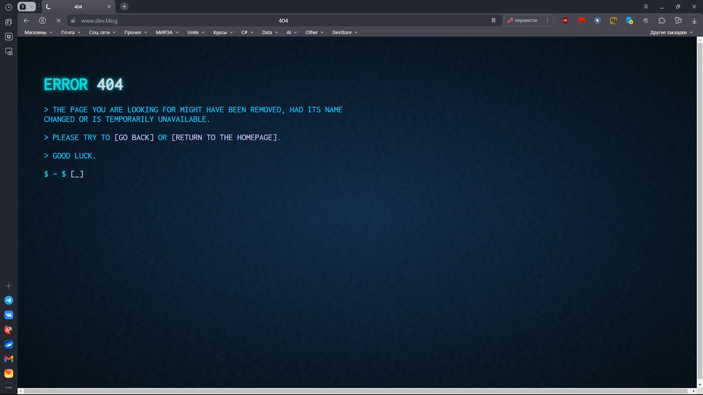

# Website: "dev.Blog"

Description: dev.Blog is an interactive platform that allows developers to showcase their skills, project experience, and education. It also offers tools for managing their blog and discovering new and interesting articles.

## Main Features

0. Home Page: Contains general information about the platform, benefits of using it, links for registration and login for developers, and several random articles.

1. Registration and Authorization: Forms for creating a new account and logging in for registered users;

2. User Profile: A page with the main information about the user and a list of their articles;

3. User Settings: A page for editing the main information about the user;

4. Article: A page with the text of the article;

5. Create Article: A form for creating a new article;

6. Admin Panel: A page for managing users, articles, and other data;

7. About: Information about the platform, its creators, and goals.

## Technical Requirements

- Frontend: HTML and CSS for structure and styling, PHP for server-side data processing;
- Backend: PHP for handling client requests and interacting with the MySQL database;
- Database: MySQL for storing information about users, their projects, blog articles, and other data;
- Server: OpenServer or another equivalent for local testing, hosting for deploying the website on the Internet.

## Implementation Steps

1. Database Structure Design: Defining tables for storing information about users, projects, articles, and other data.

2. Frontend Development: Creating the HTML structure of each page and applying CSS for styling.

3. Backend Implementation: Writing PHP scripts for processing forms, interacting with the database, and user authorization.

4. Testing: Verifying the correctness of all website components and fixing any detected errors.

5. Deployment: Deploying the website on a server.

This idea not only demonstrates your skills as a developer but also provides a useful resource for other developers interested in your experience and knowledge.

## Conclusion

dev.Blog is an excellent way to share your knowledge and experience with other developers and receive feedback and support from the community. Start creating your blog now and become part of our community!

## Author

dev.Blog is the first web project in PHP, created by [Kirill Shutov](https://github.com/ShutovKS) in 2024. If you have any questions or suggestions, please contact me via email: <i@shutovks.ru>.

## License

This project is licensed under the MIT License - see the [LICENSE](LICENSE.md) file for details.

## Screenshots

