# Сайт: "dev.Blog"

[Russian](README.ru.md) | [English](README.md)

## Описание

Описание: dev.Blog - это интерактивная платформа, которая позволяет разработчикам демонстрировать свои навыки, опыт работы над проектами, образование, а также предлагает инструменты для управления своим блогом и поиска новых и интересных статей.

## Основные функции

0. Главная страница: Содержит общую информацию о платформе, преимуществах использования, ссылки на регистрацию и вход для разработчиков, несколько случайных статей.

1. Регистрация и авторизация: Формы для создания нового аккаунта и входа в систему для зарегистрированных пользователей;

2. Профиль пользователя: Страница с основной информацией о пользователе и списком его статей;

3. Настройки пользователя: Страница с редактированием основной информацией о пользователе;

4. Статья: Страница с текстом статьи;

5. Создание статьи: Форма для создания новой статьи;

6. Админ-панель: Страница для управления пользователями, статьями и другими данными;

7. О проекте: Информация о платформе, ее создателях и целях.

## Технические требования

- Фронтенд: HTML, CSS для структуры и стилизации, PHP для обработки данных на стороне сервера;
- Бэкенд: PHP для обработки запросов от клиента, взаимодействия с базой данных MySQL;
- База данных: MySQL для хранения информации о пользователях, их проектах, статьях в блоге и других данных;
- Сервер: OpenServer или другой аналог для локального тестирования, хостинг для размещения сайта в Интернете.

## Шаги реализации

1. Проектирование структуры базы данных: Определение таблиц для хранения информации о пользователях, проектах, статьях и других данных.

2. Разработка фронтенда: Создание HTML-структуры каждой страницы, применение CSS для стилизации.

3. Реализация бэкенда: Написание PHP-скриптов для обработки форм, взаимодействия с базой данных, авторизации пользователей.

4. Тестирование: Проверка корректности работы всех компонентов сайта, исправление обнаруженных ошибок.

5. Деплой: Развертывание сайта на сервере.

Эта идея позволяет не только продемонстрировать ваши навыки как разработчика, но и предоставить полезный ресурс для других разработчиков, заинтересованных в вашем опыте и знаниях.

## Заключение

dev.Blog - это отличный способ поделиться своими знаниями и опытом с другими разработчиками, а также получить обратную связь и поддержку от сообщества. Начните создание своего блога прямо сейчас и станьте частью нашего сообщества!

## Автор

dev.Blog это первый Web проект на PHP, созданный [Шутовым Кириллом](https://github.com/ShutovKS) в 2024 году. Если у вас есть вопросы или предложения, пожалуйста, свяжитесь со мной по электронной почте: <i@shutovks.ru>.

## Лицензия

Этот проект лицензирован по лицензии MIT - подробности см. в файле [LICENSE](LICENSE.md).

## Скриншоты

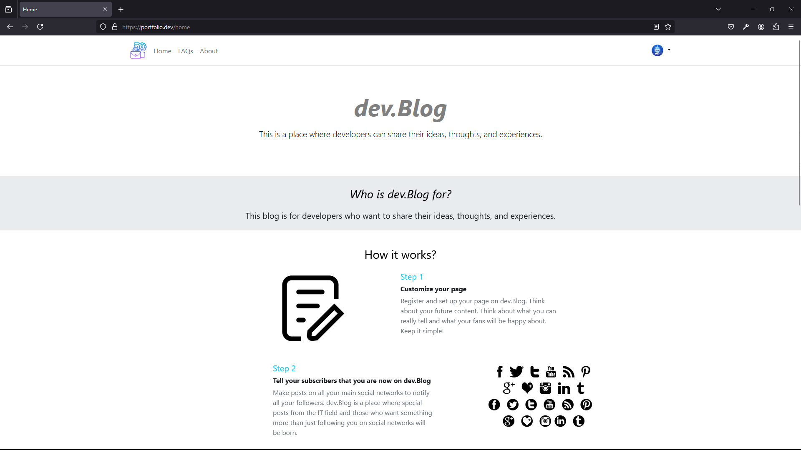
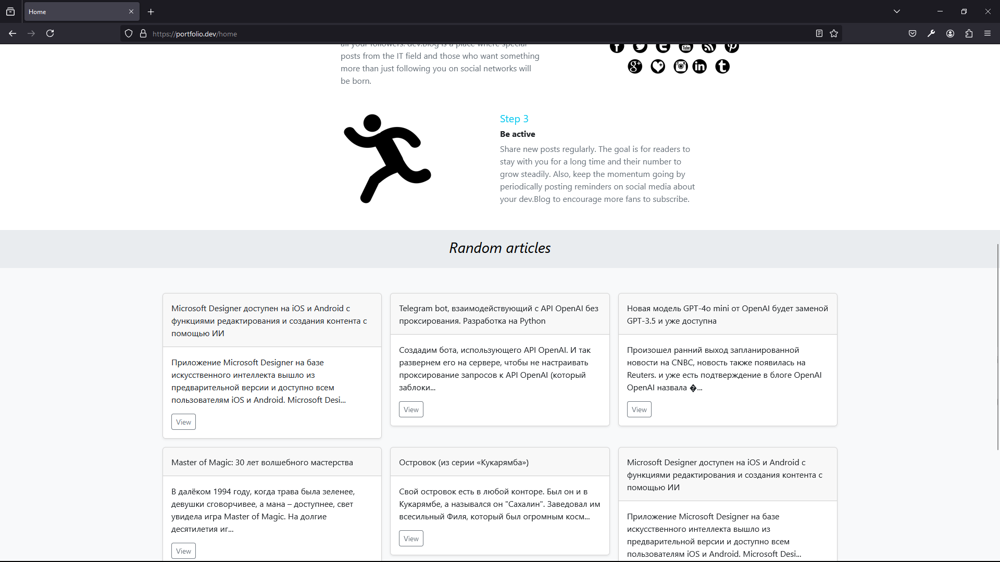

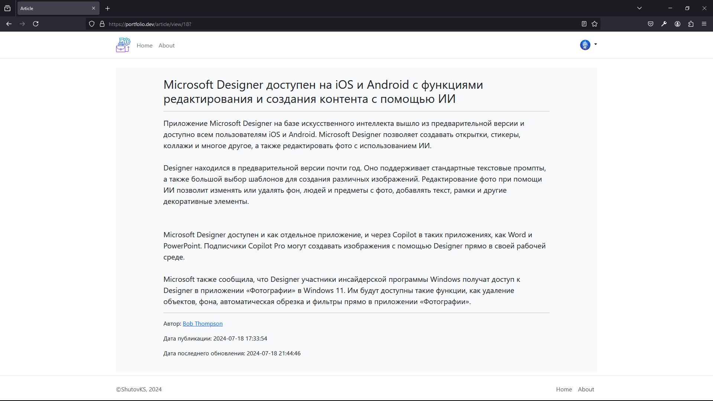

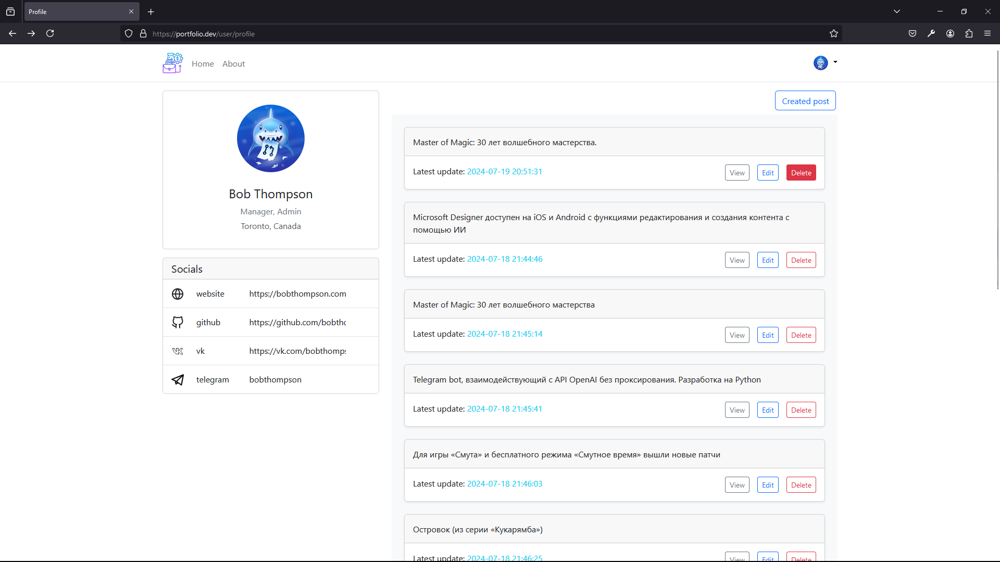

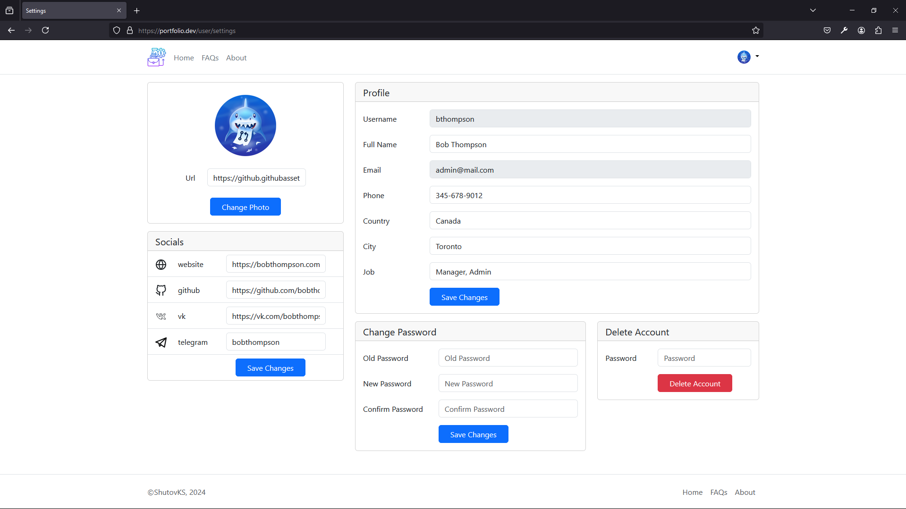

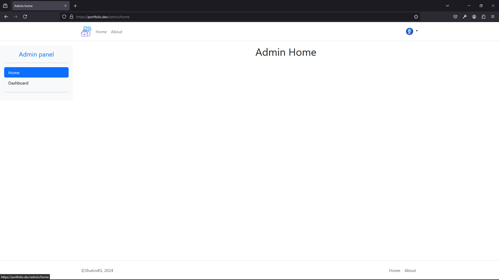
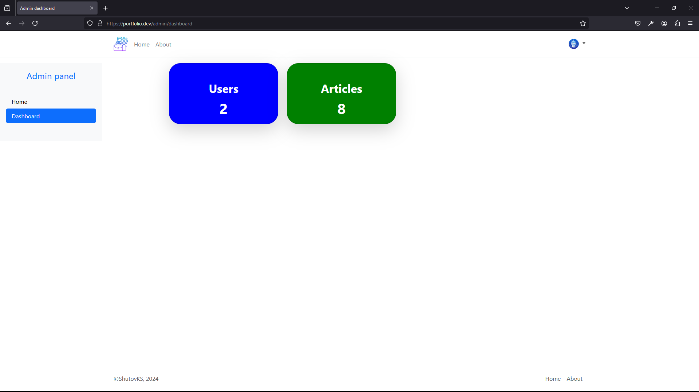
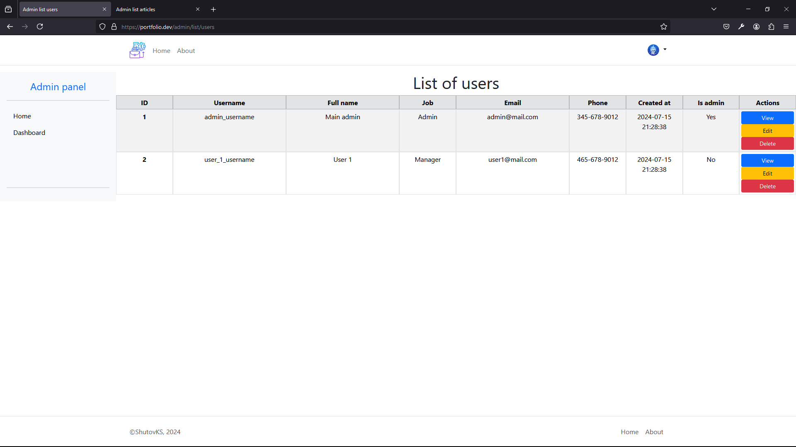
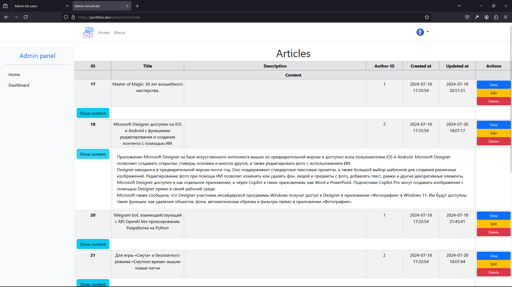

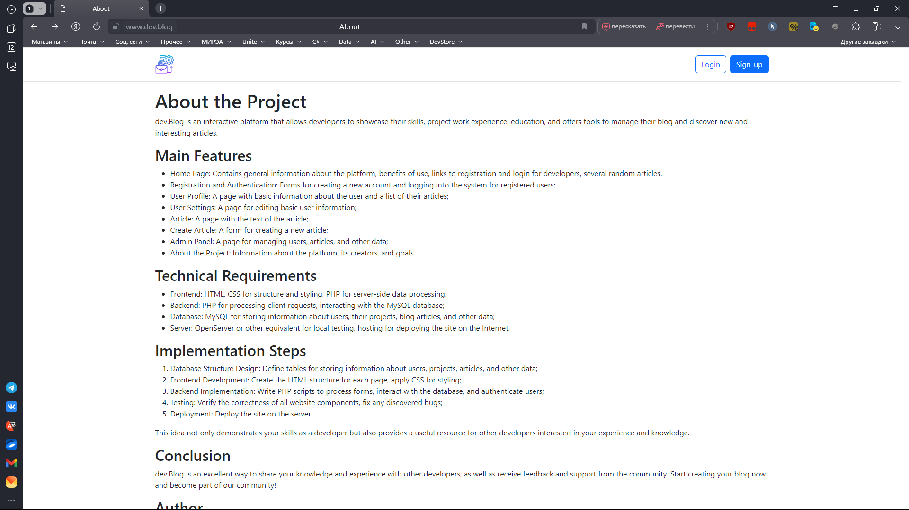

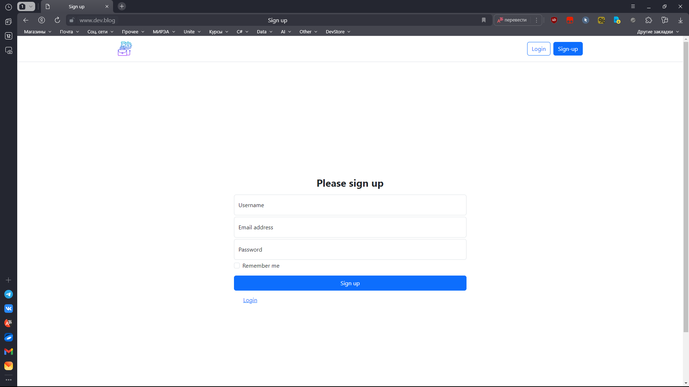

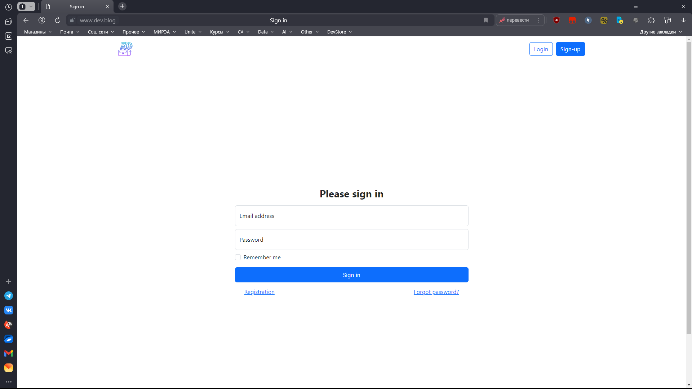

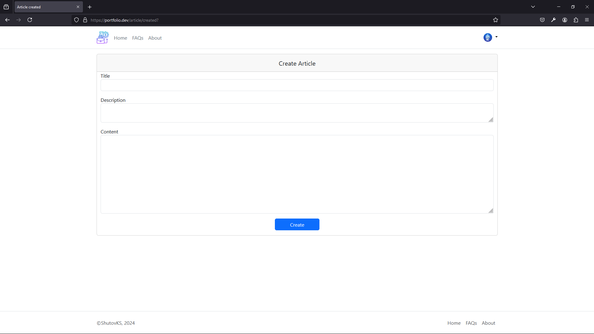

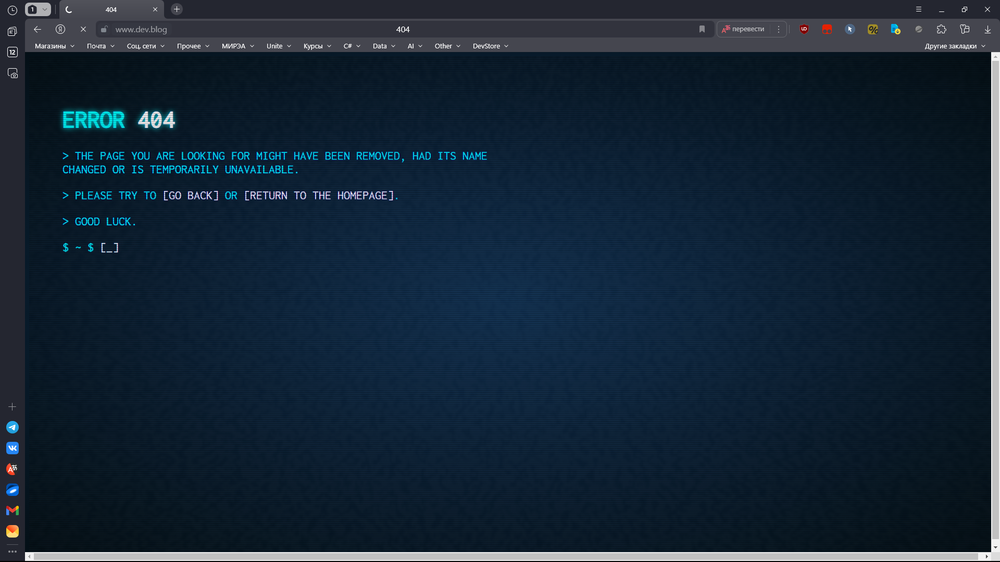
